# Research Framework Final Per-File Dependency Graph (Header+CPP Merged)

说明:
- 本文件针对 `proposed_final.md` 中的最终版架构, 给出 **逐文件 (合并 .h / .hpp / .cpp)** 的最大粒度依赖关系示意。
- 目标是研究与教学: 只展示“逻辑依赖”(实现可能使用) 的 **允许方向**，非强制实现的全部 include；实现时应保持或更严格。
- 每个文件夹使用嵌套 subgraph；同名头/源文件视作一个逻辑节点；实验/可选模块也纳入但与核心解耦。
- 不展示 examples/tests 对核心的依赖(默认只依赖 PUBLIC API)。
- Coupling 与各 Domain / Algorithm 仅通过 field_bus & param_store & exported contract 交互，不出现直接算法交叉。
- 严格 Mermaid 语法: 无花哨 linkStyle, 仅基础节点与箭头。

图例(分类颜色): 仅在注释说明, 实际图中使用简单 style classDef.
- class pub        : PUBLIC API 层
- class core       : CORE_BASE 稳定内核
- class api        : API 适配层
- class domain     : DOMAIN 根目录元素
- class algo       : ALGO 模块 (实现)
- class share      : 领域局部 shared 组件
- class couple     : 耦合模块
- class sched      : 调度策略
- class perf       : 性能插件
- class sand       : 算法沙盒 / 实验
- class util       : 通用工具
- class tele       : 遥测导出
- class plug       : 外部插件

```mermaid
flowchart TB
    %% ===================== CLASS DEFINITIONS (Refined) =====================
    classDef stableApi fill:#0d47a1,stroke:#062b5f,color:#ffffff,font-weight:bold;
    classDef stableCore fill:#263238,stroke:#455a64,color:#fafafa,font-weight:bold;
    classDef infraCore fill:#37474f,stroke:#455a64,color:#eceff1;
    classDef domainRoot fill:#283593,stroke:#1a237e,color:#ffffff,font-weight:bold;
    classDef sharedLocal fill:#558b2f,stroke:#33691e,color:#ffffff;
    classDef algoVariant fill:#2e7d32,stroke:#1b5e20,color:#e8f5e9;
    classDef algoExtPlaceholder fill:#66bb6a,stroke:#1b5e20,color:#0d260d;
    classDef couplingMod fill:#6a1b9a,stroke:#4a148c,color:#f3e5f5;
    classDef couplingExt fill:#9c27b0,stroke:#4a148c,color:#ffffff;
    classDef scheduler fill:#00796b,stroke:#004d40,color:#ffffff;
    classDef perfOpt fill:#546e7a,stroke:#37474f,color:#eceff1;
    classDef sandbox fill:#5d4037,stroke:#3e2723,color:#ffffff;
    classDef telemetryNode fill:#37474f,stroke:#263238,color:#eceff1;
    classDef pluginNode fill:#ad1457,stroke:#880e4f,color:#ffffff;
    classDef experimental fill:#ff9800,stroke:#e65100,color:#212121;
    classDef extensionPoint fill:#cfd8dc,stroke:#607d8b,color:#263238;

    %% ===================== PUBLIC API =====================
    subgraph PUBLIC_API[include_rphys]
        api_world[api_world]:::stableApi
        api_domain[api_domain]:::stableApi
        api_algorithm[api_algorithm]:::stableApi
        api_scene[api_scene]:::stableApi
        api_params[api_params]:::stableApi
        api_fields[api_fields]:::stableApi
        api_coupling[api_coupling]:::stableApi
        api_events[api_events]:::stableApi
        api_commands[api_commands]:::stableApi
        api_telemetry[api_telemetry]:::stableApi
        api_status[api_status]:::stableApi
        api_capability[api_capability]:::stableApi
        api_version[api_version]:::stableApi
        api_ids[api_ids]:::stableApi
        forward[forward]:::stableApi
    end

    %% ===================== CORE BASE =====================
    subgraph CORE_BASE[core_base]
        world_core[world_core]:::stableCore
        domain_core[domain_core]:::stableCore
        algo_core[algo_core]:::stableCore
        field_bus[field_bus]:::infraCore
        param_store[param_store]:::infraCore
        telemetry_core[telemetry_core]:::infraCore
        status_codes[status_codes]:::infraCore
    end

    %% ===================== API LAYER =====================
    subgraph API_LAYER[api_layer]
        gateway_world[gateway_world]:::infraCore
        gateway_domain[gateway_domain]:::infraCore
        gateway_algorithm[gateway_algorithm]:::infraCore
        gateway_coupling[gateway_coupling]:::infraCore
        gateway_fields[gateway_fields]:::infraCore
    end

    %% ===================== DOMAINS =====================
    subgraph DOMAINS[domains]
        subgraph D_CLOTH[domain_cloth]
            cloth_contract[pipeline_contract]:::domainRoot
            subgraph CLOTH_ALGOS[algorithms]
                cloth_pbd[pbd_cloth]:::algoVariant
                cloth_xpbd[xpbd_cloth]:::algoVariant
                cloth_fem[fem_cloth]:::algoVariant
                cloth_stable_pd[stable_pd_cloth]:::algoVariant
                cloth_exp_x[experimental_X]:::experimental
                cloth_algo_placeholder[cloth_algo_*]:::algoExtPlaceholder
            end
            subgraph CLOTH_SHARED[shared]
                cloth_mesh_build[mesh_build]:::sharedLocal
                cloth_bending_energy[bending_energy]:::sharedLocal
                cloth_area_cache[area_cache]:::sharedLocal
            end
        end
        subgraph D_FLUID[domain_fluid]
            fluid_contract[pipeline_contract]:::domainRoot
            subgraph FLUID_ALGOS[algorithms]
                fluid_sph[sph_fluid]:::algoVariant
                fluid_mpm[mpm_fluid]:::algoVariant
                fluid_flip[flip_fluid]:::algoVariant
                fluid_algo_placeholder[fluid_algo_*]:::algoExtPlaceholder
            end
            subgraph FLUID_SHARED[shared]
                fluid_neighbor[neighbor_search]:::sharedLocal
                fluid_kernel_w[kernel_weights]:::sharedLocal
            end
        end
        subgraph D_GAS[domain_gas]
            gas_contract[pipeline_contract]:::domainRoot
            subgraph GAS_ALGOS[algorithms]
                gas_grid[grid_gas]:::algoVariant
                gas_lb[lattice_boltzmann]:::algoVariant
                gas_algo_placeholder[gas_algo_*]:::algoExtPlaceholder
            end
            subgraph GAS_SHARED[shared]
                gas_advect[advection_schemes]:::sharedLocal
            end
        end
        subgraph D_RIGID[domain_rigid]
            rigid_contract[pipeline_contract]:::domainRoot
            subgraph RIGID_ALGOS[algorithms]
                rigid_impulse[impulse_rigid]:::algoVariant
                rigid_xpbd[xpbd_rigid]:::algoVariant
                rigid_feather[featherstone_rigid]:::algoVariant
                rigid_algo_placeholder[rigid_algo_*]:::algoExtPlaceholder
            end
        end
        subgraph D_TEMPLATE[domain_new_template]
            new_domain_contract[pipeline_contract]:::extensionPoint
            new_domain_algo_placeholder[new_domain_algo_*]:::extensionPoint
        end
    end

    %% ===================== COUPLING MODULES =====================
    subgraph COUPLING[coupling_modules]
        cloth_fluid_exchange_contract[cloth_fluid_exchange_contract]:::couplingMod
        drag_strategy[cloth_fluid_simple_drag]:::couplingMod
        pressure_strategy[cloth_fluid_two_way_pressure]:::couplingMod
        cloth_rigid_contact_contract[cloth_rigid_contact_contract]:::couplingMod
        contact_penalty[cloth_rigid_penalty]:::couplingMod
        contact_projection[cloth_rigid_projection]:::couplingMod
        multi_field_mix[multi_field_mix]:::couplingMod
        coupling_template[coupling_module_*]:::couplingExt
    end

    %% ===================== SANDBOX =====================
    subgraph SANDBOX[algo_sandbox]
        sandbox_run_matrix[run_matrix]:::sandbox
        sandbox_diff_fields[diff_fields]:::sandbox
        sandbox_param_scan[param_scan_tool]:::sandbox
    end

    %% ===================== SCHEDULERS =====================
    subgraph SCHEDULERS[schedulers]
        sched_serial[serial]:::scheduler
        sched_task_pool[task_pool]:::scheduler
        sched_job_stub[job_system_stub]:::scheduler
        sched_gpu_stub[gpu_stub]:::scheduler
        sched_new_placeholder[scheduler_*]:::extensionPoint
    end

    %% ===================== PERF LAYERS =====================
    subgraph PERF[perf_layers]
        perf_layout_pack[layout_pack]:::perfOpt
        perf_simd_vec[simd_vec]:::perfOpt
        perf_gpu_backend[gpu_backend]:::perfOpt
        perf_cache_accel[cache_accel]:::perfOpt
        perf_future_opt[future_opt_*]:::experimental
    end

    %% ===================== TELEMETRY / PLUGINS =====================
    subgraph TELEMETRY_EXPORT[telemetry_export]
        tele_json[json_dump]:::telemetryNode
        tele_csv[csv_dump]:::telemetryNode
    end
    subgraph PLUGINS[plugins]
        plugin_sample[sample_plugin_register]:::pluginNode
        plugin_placeholder[plugin_*]:::extensionPoint
    end

    %% ===================== DEPENDENCIES =====================
    api_world --> gateway_world
    api_domain --> gateway_domain
    api_algorithm --> gateway_algorithm
    api_coupling --> gateway_coupling
    api_fields --> gateway_fields
    api_params --> gateway_world
    api_commands --> gateway_world
    api_events --> gateway_world
    api_telemetry --> gateway_world

    gateway_world --> world_core
    gateway_domain --> domain_core
    gateway_algorithm --> algo_core
    gateway_coupling --> field_bus
    gateway_fields --> field_bus
    gateway_world --> param_store
    gateway_world --> telemetry_core

    world_core --> domain_core
    domain_core --> algo_core
    algo_core --> field_bus
    algo_core --> param_store

    cloth_contract --> domain_core
    cloth_contract --> param_store
    cloth_contract --> field_bus
    fluid_contract --> domain_core
    fluid_contract --> field_bus
    gas_contract --> domain_core
    rigid_contract --> domain_core
    new_domain_contract --> domain_core

    cloth_pbd --> cloth_contract
    cloth_pbd --> param_store
    cloth_pbd --> cloth_mesh_build
    cloth_xpbd --> cloth_contract
    cloth_xpbd --> param_store
    cloth_fem --> cloth_contract
    cloth_fem --> cloth_mesh_build
    cloth_stable_pd --> cloth_contract
    cloth_exp_x --> cloth_contract
    cloth_algo_placeholder --> cloth_contract

    fluid_sph --> fluid_contract
    fluid_sph --> fluid_neighbor
    fluid_mpm --> fluid_contract
    fluid_flip --> fluid_contract
    fluid_algo_placeholder --> fluid_contract

    gas_grid --> gas_contract
    gas_lb --> gas_contract
    gas_algo_placeholder --> gas_contract

    rigid_impulse --> rigid_contract
    rigid_xpbd --> rigid_contract
    rigid_feather --> rigid_contract
    rigid_algo_placeholder --> rigid_contract

    new_domain_algo_placeholder --> new_domain_contract

    cloth_fluid_exchange_contract --> field_bus
    drag_strategy --> cloth_fluid_exchange_contract
    pressure_strategy --> cloth_fluid_exchange_contract
    cloth_rigid_contact_contract --> field_bus
    contact_penalty --> cloth_rigid_contact_contract
    contact_projection --> cloth_rigid_contact_contract
    multi_field_mix --> field_bus
    coupling_template --> field_bus

    sandbox_run_matrix --> api_world
    sandbox_diff_fields --> api_fields
    sandbox_param_scan --> api_algorithm

    sched_serial --> domain_core
    sched_task_pool --> domain_core
    sched_job_stub --> domain_core
    sched_gpu_stub --> domain_core
    sched_new_placeholder --> domain_core

    perf_layout_pack --> field_bus
    perf_simd_vec --> perf_layout_pack
    perf_gpu_backend --> perf_layout_pack
    perf_cache_accel --> field_bus
    perf_future_opt --> field_bus

    tele_json --> telemetry_core
    tele_csv --> telemetry_core

    plugin_sample --> algo_core
    plugin_placeholder --> algo_core
```

---
## 备注
- 箭头方向均指“允许/需要依赖” (A --> B 表示 A 可以包含/调用 B)。
- 未标出的 cross 依赖视为禁止 (例如 cloth 算法不得指向 fluid_shared)。
- 扩展: 新增领域只需复制 domain_<X>/pipeline_contract.hpp + algorithms/<variant>/impl_*.
- 可选: 可对 perf_layers / schedulers / coupling_modules 做独立构建开关。
- 若实现 GPU, 在 perf_layers/gpu_backend 下新增子目录, 通过 runtime capability 选择。

(完)
